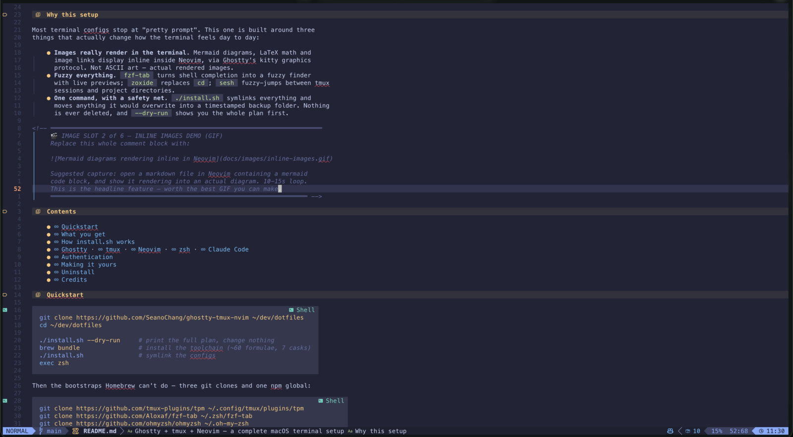
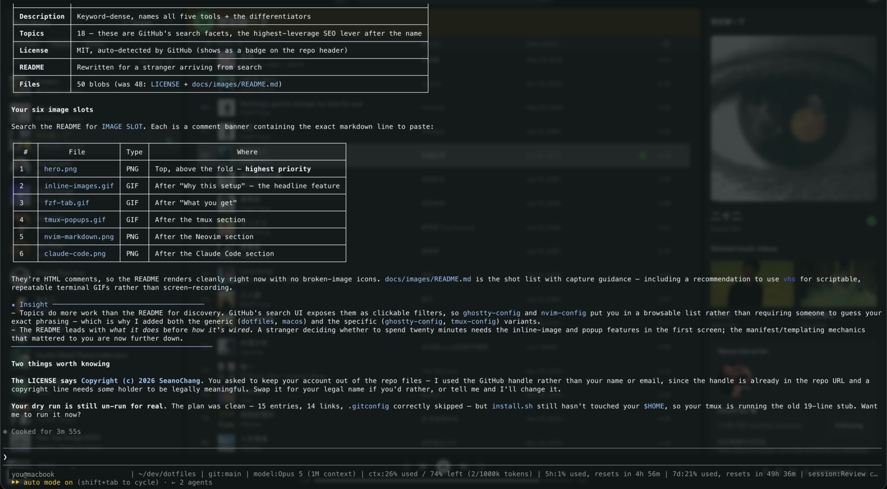

<div align="center">

# Ghostty + tmux + Neovim — a complete macOS terminal setup

**A power-user terminal environment you can install in one command.**
Ghostty · tmux · Neovim (LazyVim) · zsh · Claude Code

[](https://www.apple.com/macos/)
[](https://ghostty.org)
[](https://github.com/tmux/tmux)
[](https://neovim.io)
[](https://lazyvim.github.io)
[](LICENSE)

</div>

<!-- ══════════════════════════════════════════════════════════════════════════
     📸 IMAGE SLOT 1 of 6 — HERO
     Replace this whole comment block with:

     

     Suggested capture: full Ghostty window, ~1600px wide. tmux status bar
     visible at the bottom, Neovim open on a markdown file that's rendering a
     mermaid diagram inline. This is the single most important image — it is
     what people see before they read a word.
     ══════════════════════════════════════════════════════════════════════ -->

## Why this setup

Most terminal configs stop at "pretty prompt". This one is built around three
things that actually change how the terminal feels day to day:

- **Images really render in the terminal.** Mermaid diagrams, LaTeX math and
  image links display inline inside Neovim, via Ghostty's kitty graphics
  protocol. Not ASCII art — actual rendered images.
- **Fuzzy everything.** `fzf-tab` turns shell completion into a fuzzy finder
  with live previews; `zoxide` replaces `cd`; `sesh` fuzzy-jumps between tmux
  sessions and project directories.
- **One command, with a safety net.** `./install.sh` symlinks everything and
  moves anything it would overwrite into a timestamped backup folder. Nothing
  is ever deleted, and `--dry-run` shows you the whole plan first.

<!-- ══════════════════════════════════════════════════════════════════════════
     🎬 IMAGE SLOT 2 of 6 — INLINE IMAGES DEMO (GIF)
     Replace this whole comment block with:

     

     Suggested capture: open a markdown file in Neovim containing a mermaid
     code block, and show it rendering into an actual diagram. 10-15s loop.
     This is the headline feature — worth the best GIF you can make.
     ══════════════════════════════════════════════════════════════════════ -->

## Contents

- [Quickstart](#quickstart)
- [What you get](#what-you-get)
- [How install.sh works](#how-installsh-works)
- [Ghostty](#ghostty) · [tmux](#tmux) · [Neovim](#neovim) · [zsh](#zsh) · [Claude Code](#claude-code)
- [Authentication](#authentication)
- [Making it yours](#making-it-yours)
- [Uninstall](#uninstall)
- [Credits](#credits)

## Quickstart

```sh
git clone https://github.com/SeanoChang/ghostty-tmux-nvim ~/dev/dotfiles
cd ~/dev/dotfiles

./install.sh --dry-run     # print the full plan, change nothing
brew bundle                # install the toolchain (~60 formulae, 7 casks)
./install.sh               # symlink the configs
exec zsh
```

Then the bootstraps Homebrew can't do — three git clones and one npm global:

```sh
git clone https://github.com/tmux-plugins/tpm ~/.config/tmux/plugins/tpm
git clone https://github.com/Aloxaf/fzf-tab ~/.zsh/fzf-tab
git clone https://github.com/ohmyzsh/ohmyzsh ~/.oh-my-zsh
npm install -g @mermaid-js/mermaid-cli      # `mmdc`, for inline diagram rendering

tmux                       # then: prefix (Ctrl-b) + I   → installs tmux plugins
nvim                       # lazy.nvim bootstraps itself on first launch
```

> **Requirements:** macOS on Apple Silicon, [Homebrew](https://brew.sh), and a
> [Nerd Font](https://www.nerdfonts.com/) (the Brewfile does not install fonts —
> this config uses **MesloLGS NF**).

## What you get

| Tool | What it's doing here |
|---|---|
| **[Ghostty](https://ghostty.org)** | GPU-accelerated terminal. Custom palette, 80% opacity with blur, global dropdown hotkey, and splits/tabs bound to macOS muscle memory |
| **[tmux](https://github.com/tmux/tmux)** | Default `Ctrl-b` prefix kept, floating popups for lazygit/yazi/sessions, seamless `Ctrl-hjkl` movement between tmux panes and Neovim splits, session persistence across reboots |
| **[Neovim](https://neovim.io) + [LazyVim](https://lazyvim.github.io)** | 21 LazyVim extras, 51 plugins. `Space` leader with which-key, `g` goto family, plus an optional macOS layer (`Cmd+S`, `Cmd+/`, `Alt+↑↓`) and inline image/diagram rendering |
| **[zsh](https://www.zsh.org)** | [powerlevel10k](https://github.com/romkatv/powerlevel10k) instant prompt, [fzf-tab](https://github.com/Aloxaf/fzf-tab) fuzzy completion with previews, [zoxide](https://github.com/ajeetdsouza/zoxide), [eza](https://github.com/eza-community/eza) |
| **[Claude Code](https://claude.com/claude-code)** | Global working rules, a custom statusline showing model + context usage + rate limits, and two custom slash commands |

<!-- ══════════════════════════════════════════════════════════════════════════
     🎬 IMAGE SLOT 3 of 6 — FUZZY COMPLETION (GIF)
     Replace this whole comment block with:

     

     Suggested capture: type `cd ` then hit Tab, and scroll through directories
     with the eza preview updating live on the right. Then `nvim ` + Tab to show
     the bat file preview. ~10s loop.
     ══════════════════════════════════════════════════════════════════════ -->

## How install.sh works

It reads [`manifest.txt`](manifest.txt) — a three-column list of `mode`,
`source`, `destination` — and for each entry:

- **`link`** symlinks the destination at the repo file, so editing a config in
  place edits the repo.
- **`copy`** copies the file **only if the destination doesn't exist**. Used for
  `~/.gitconfig`: if it were a symlink, `git config --global user.email …` would
  write your address straight into a tracked file in a public repo.
- A `.tmpl` source is rendered first — `__HOME__` becomes your real `$HOME`.
  Rendered output lands in `~/.dotfiles-rendered/`, outside the repo.

Anything already occupying a destination is **moved** to
`~/.dotfiles-backup/<timestamp>/`, preserving its path. Nothing is deleted.
Re-running is safe — correct symlinks are left alone.

```sh
./install.sh --dry-run       # print the plan, change nothing
./install.sh --only nvim     # install one group
./install.sh --help
```

Groups are the path segment after `config/`: `ghostty`, `tmux`, `nvim`, `zsh`,
`git`, `claude`, `mermaid`.

<details>
<summary><b>Repo layout</b></summary>

```
├── install.sh              manifest-driven symlinker with backup + dry-run
├── manifest.txt            mode / source / destination
├── Brewfile                the toolchain every config depends on
└── config/
    ├── ghostty/config
    ├── tmux/tmux.conf
    ├── nvim/               init.lua, lua/, lazy-lock.json, lazyvim.json
    ├── zsh/                zshrc, zprofile, zshenv, p10k.zsh
    ├── git/                gitconfig.tmpl (placeholders), ignore
    ├── claude/             CLAUDE.md, settings.json.tmpl, statusline, commands, skills
    └── mermaid/            TokyoNight mermaid theme
```

</details>

## Ghostty

A port of a long-lived iTerm2 profile: MesloLGS NF at 13pt, 80% background
opacity with blur radius 10, block cursor, and the stock iTerm2 ANSI palette.

Keybindings follow macOS conventions rather than terminal ones:

| Key | Action |
|---|---|
| `Cmd+\`` (global) | Toggle quick dropdown terminal from anywhere |
| `Cmd+D` / `Cmd+Shift+D` | Split right / split down |
| `Cmd+Opt+←↑↓→` | Move between splits |
| `Cmd+Shift+Enter` | Zoom split |
| `Cmd+K` | Clear screen |

## tmux

Prefix stays the **default `Ctrl-b`**, and the default bindings you already know
keep working — `%` and `"` still split (they just inherit the current directory
now), and `prefix + ←↑↓→` still moves between panes. Nothing you've built muscle
memory for is taken away; everything below is additive.

The best part is the popups. `display-popup` floats a real terminal over your
layout, so tools appear and vanish without disturbing your panes:

| Key | Action |
|---|---|
| `prefix + g` | [lazygit](https://github.com/jesseduffield/lazygit) in a floating window |
| `prefix + f` | [yazi](https://github.com/sxyazi/yazi) file manager |
| `prefix + s` | [sesh](https://github.com/joshmedeski/sesh) session picker — running sessions *and* zoxide directories, fuzzy-found |
| `prefix + t` | Scratch session that follows you between projects |
| `prefix + a` / `A` / `C` | Claude Code as a side pane / own window / throwaway popup |

`Ctrl-hjkl` moves between tmux panes and Neovim splits interchangeably. Sessions
survive reboots via [resurrect](https://github.com/tmux-plugins/tmux-resurrect) +
[continuum](https://github.com/tmux-plugins/tmux-continuum).

<!-- ══════════════════════════════════════════════════════════════════════════
     🎬 IMAGE SLOT 4 of 6 — TMUX POPUPS (GIF)
     Replace this whole comment block with:

     

     Suggested capture: hit prefix+g to float lazygit over a working layout,
     close it, then prefix+s to fuzzy-jump to another session. ~12s loop —
     this is the clearest "oh, I want that" moment in the whole setup.
     ══════════════════════════════════════════════════════════════════════ -->

## Neovim

[LazyVim](https://lazyvim.github.io) as the base, with 21 extras enabled and 51
plugins pinned in `lazy-lock.json`.

**The LazyVim workflow, unchanged.** `Space` is the leader, and
[which-key](https://github.com/folke/which-key.nvim) pops up the command list as
soon as you press it — so you discover bindings by using them rather than by
memorising them. `g` prefixes the goto family (`gd` definition, `gr` references,
`gc` comment). If you know LazyVim, you already know this config.

**Plus a macOS layer on top,** for the times your hands reach for the OS
shortcut instead: `Cmd+S` save, `Cmd+/` comment, `Cmd+Z` undo, `Alt+↑↓` move
lines, `Alt+Shift+↑↓` duplicate, `jk` to escape insert mode. Additive — normal
vim motions are untouched.

**Markdown that actually looks like markdown.** LazyVim's default renderer is
swapped for [markview.nvim](https://github.com/OXY2DEV/markview.nvim), prose is
hard-wrapped at 80 columns by prettier, and markdownlint is silenced. The config
also carries a `build` hook that **patches markview's source on every update** —
disabling an early-return so wide tables keep rendering when scrolled
horizontally. If markview changes upstream, the hook warns instead of failing
silently.

**Inline images.** [snacks.nvim](https://github.com/folke/snacks.nvim) renders
mermaid diagrams, LaTeX math and image links as real images, using a custom
TokyoNight mermaid theme. Requires a kitty-graphics terminal (Ghostty qualifies)
plus `imagemagick`, `ghostscript`, `tectonic` — all in the Brewfile — and
`mermaid-cli` from npm.



## zsh

powerlevel10k with instant prompt, so the prompt paints before plugins finish
loading. `fzf-tab` replaces the completion menu with a fuzzy finder that previews
directories with `eza` and files with `bat`. `chpwd` lists the directory on every
`cd`. `conda` is a lazy shim that replaces itself on first call, so it costs
nothing at shell startup.

```sh
y            # yazi, but cd's to wherever you quit
z <partial>  # zoxide — jump to any directory you've visited
gbda         # delete every local branch already merged into main
```

## Claude Code

`CLAUDE.md` holds global working rules — reproduce bugs before fixing them, show
evidence before claiming success, never run mutating infra commands, never print
secrets. `settings.json` enables 16 official plugins and a custom statusline:

```
sean@host | ~/dev/project | git:main*+2 | model:Opus | ctx:38% used / 62% left
(76k/200k tokens) | 5h:12% used, resets in 2h 14m
```



## Authentication

**No tokens, keys or session state are in this repo** — every config here is
safe to read, fork and publish. After installing, log in to whatever you use:

| Tool | Command |
|---|---|
| GitHub CLI | `gh auth login` |
| Claude Code | `claude` — browser OAuth on first run; MCP connectors via `/mcp` |
| AWS | `aws configure` |
| Google Cloud | `gcloud auth login && gcloud auth application-default login` |
| GitHub Copilot | `:Copilot auth` inside Neovim |

`~/.gitconfig` is created from a template with placeholders. Set your identity:

```sh
git config --global user.name  "Your Name"
git config --global user.email "you@example.com"
```

## Making it yours

This is my setup, so treat it as a starting point rather than gospel:

- **Fonts and colours** live in `config/ghostty/config` and the status bar block
  in `config/tmux/tmux.conf` (section 6). Both are heavily commented.
- **Don't want a group?** Delete its lines from `manifest.txt`, or just run
  `./install.sh --only nvim` to take one piece.
- **Prefer `Ctrl-b`?** One line in `config/tmux/tmux.conf` section 2.
- **Neovim plugins** go in `config/nvim/lua/plugins/` — add a file, LazyVim
  picks it up automatically.

## Uninstall

`install.sh` only creates symlinks and one copied file, so deleting them is
enough. Your originals are in `~/.dotfiles-backup/<timestamp>/`.

## Credits

Standing on a lot of shoulders — please star the upstream projects:

[Ghostty](https://ghostty.org) ·
[tmux](https://github.com/tmux/tmux) ·
[Neovim](https://neovim.io) ·
[LazyVim](https://lazyvim.github.io) ·
[snacks.nvim](https://github.com/folke/snacks.nvim) ·
[markview.nvim](https://github.com/OXY2DEV/markview.nvim) ·
[powerlevel10k](https://github.com/romkatv/powerlevel10k) ·
[fzf-tab](https://github.com/Aloxaf/fzf-tab) ·
[zoxide](https://github.com/ajeetdsouza/zoxide) ·
[eza](https://github.com/eza-community/eza) ·
[yazi](https://github.com/sxyazi/yazi) ·
[lazygit](https://github.com/jesseduffield/lazygit) ·
[sesh](https://github.com/joshmedeski/sesh) ·
[tpm](https://github.com/tmux-plugins/tpm)

## License

[MIT](LICENSE) — take what's useful.

`config/nvim/LICENSE` is the upstream LazyVim starter license, and
`config/zsh/p10k.zsh` is generated by powerlevel10k's own configuration wizard.
