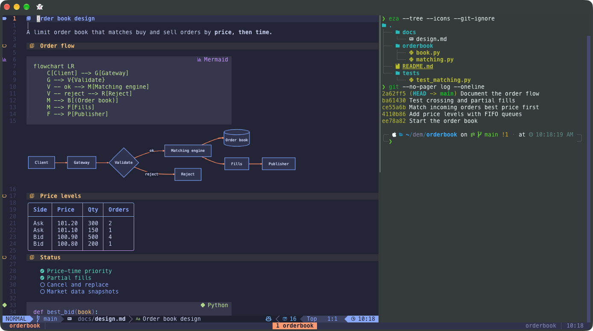
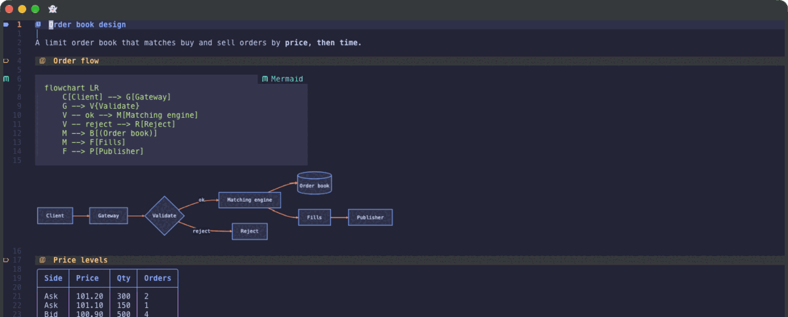
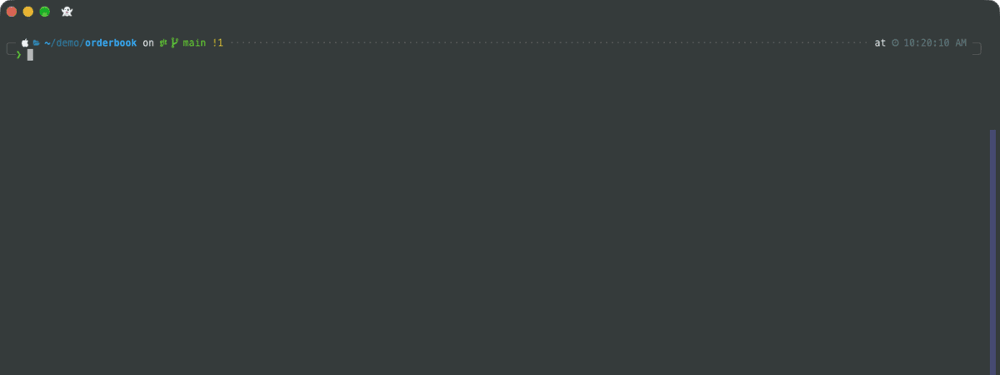
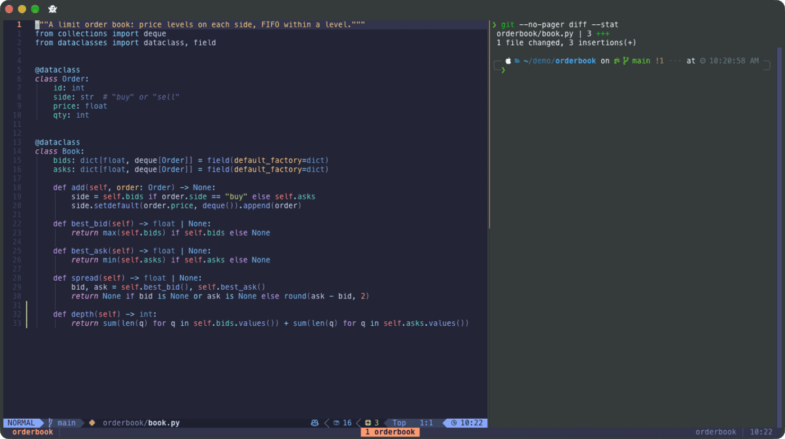
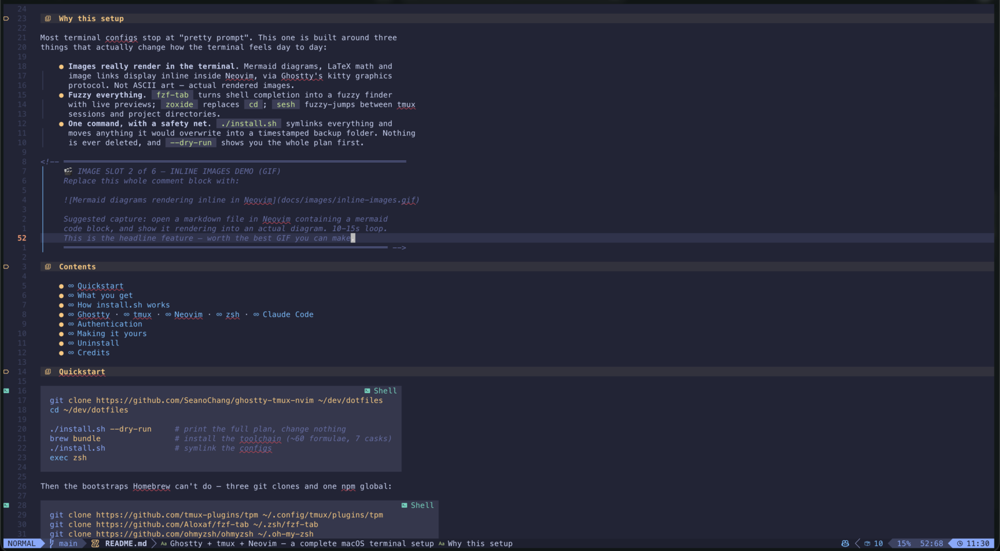
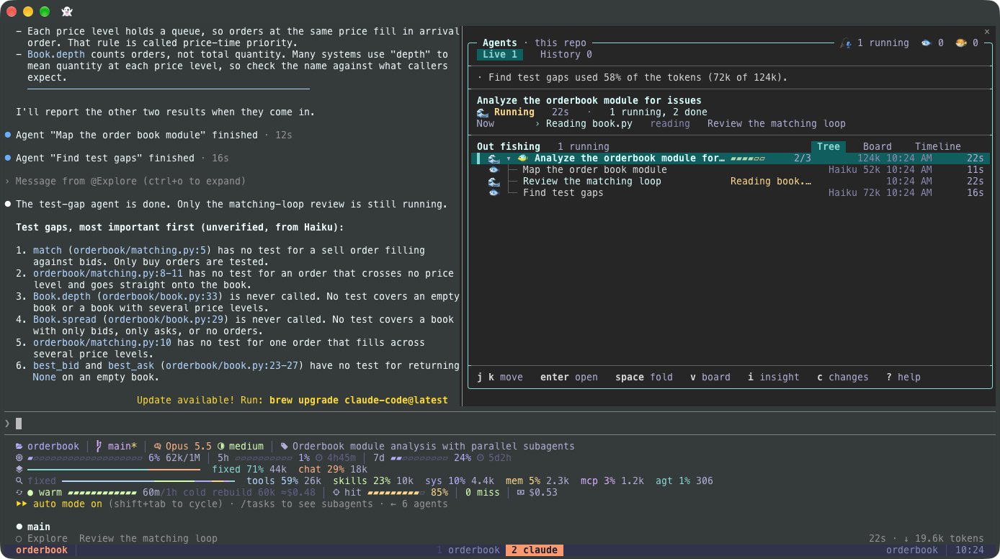
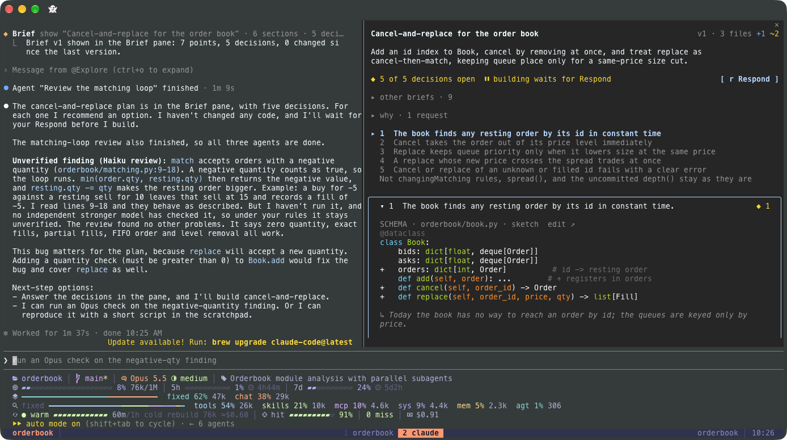

<div align="center">

# Ghostty + tmux + Neovim — a complete macOS terminal setup

**A power-user terminal environment you can install in one command.**
Ghostty · tmux · Neovim (LazyVim) · zsh · Claude Code

[](https://www.apple.com/macos/)
[](https://ghostty.org)
[](https://github.com/tmux/tmux)
[](https://neovim.io)
[](https://lazyvim.github.io)
[](LICENSE)

</div>



## Why this setup

Most terminal configs stop at a pretty prompt. This one is built around four
things that change how the terminal feels day to day:

- **Images render in the terminal.** Mermaid diagrams, LaTeX math and image
  links show inline in Neovim, through Ghostty's kitty graphics protocol. They
  are real images, not ASCII art, and they redraw as you type.
- **Fuzzy everything.** `fzf-tab` turns shell completion into a fuzzy finder
  with live previews. `zoxide` replaces `cd`. `sesh` jumps between tmux sessions
  and project folders.
- **Claude Code is part of the setup.** Global working rules, a five-line status
  line, hooks, seven skills, and five mods that add native panes: a live tree
  of subagents, and a plan pane beside the chat.
- **One command, with a safety net.** `./install.sh` links everything and moves
  anything in the way into a timestamped backup folder. It never deletes, and
  `--dry-run` prints the whole plan first.



## Contents

- [Quickstart](#quickstart)
- [What you get](#what-you-get)
- [How install.sh works](#how-installsh-works)
- [Ghostty](#ghostty) · [tmux](#tmux) · [Neovim](#neovim) · [zsh](#zsh) · [Claude Code](#claude-code)
- [Authentication](#authentication)
- [Making it yours](#making-it-yours)
- [Uninstall](#uninstall)
- [Credits](#credits)

## Quickstart

```sh
git clone https://github.com/SeanoChang/ghostty-tmux-nvim ~/dev/dotfiles
cd ~/dev/dotfiles

./install.sh --dry-run     # print the full plan, change nothing
brew bundle                # install the toolchain
./install.sh               # link the configs
exec zsh
```

Then the bootstraps Homebrew can't do — three git clones and one npm global:

```sh
git clone https://github.com/tmux-plugins/tpm ~/.config/tmux/plugins/tpm
git clone https://github.com/Aloxaf/fzf-tab ~/.zsh/fzf-tab
git clone https://github.com/ohmyzsh/ohmyzsh ~/.oh-my-zsh
npm install -g @mermaid-js/mermaid-cli      # `mmdc`, for inline diagram rendering

tmux                       # then: prefix (Ctrl-b) + I   → installs tmux plugins
nvim                       # lazy.nvim bootstraps itself on first launch
```

> **Requirements:** macOS on Apple Silicon, [Homebrew](https://brew.sh), and a
> [Nerd Font](https://www.nerdfonts.com/). The Brewfile does not install fonts;
> this config uses **MesloLGS NF**.

## What you get

| Tool | What it does here |
|---|---|
| **[Ghostty](https://ghostty.org)** | GPU-accelerated terminal. Custom palette, 80% opacity with blur, transparent title bar, a global dropdown hotkey, and splits and tabs on macOS shortcuts |
| **[tmux](https://github.com/tmux/tmux)** | Default `Ctrl-b` prefix. Floating popups for lazygit, yazi, sessions and builds. `Ctrl-hjkl` moves between tmux panes and Neovim splits alike. Sessions survive reboots |
| **[Neovim](https://neovim.io) + [LazyVim](https://lazyvim.github.io)** | 23 LazyVim extras, including Go, Python, Java and C/C++. `Space` leader with which-key, a macOS shortcut layer, and inline image and diagram rendering |
| **[zsh](https://www.zsh.org)** | [powerlevel10k](https://github.com/romkatv/powerlevel10k) instant prompt, [fzf-tab](https://github.com/Aloxaf/fzf-tab) fuzzy completion with previews, [zoxide](https://github.com/ajeetdsouza/zoxide), [eza](https://github.com/eza-community/eza) |
| **[Claude Code](https://claude.com/claude-code)** | Global working rules, a five-line status line, two hooks, two slash commands, seven skills, five mods, and a `claude-or` wrapper that routes the CLI through OpenRouter |



## How install.sh works

It reads [`manifest.txt`](manifest.txt), a three-column list of `mode`,
`source` and `destination`. For each entry:

- **`link`** points the destination at the repo file, so editing a config in
  place edits the repo.
- **`copy`** copies the file **only if the destination doesn't exist**. It is
  used for `~/.gitconfig`: as a link, `git config --global user.email …` would
  write your address into a tracked file in a public repo.
- **`merge`** keeps the destination a real folder and links each entry of the
  source into it. The machine can still add its own entries. Skills, slash
  commands, hooks and mods install this way.
- A `.tmpl` source is rendered first: `__HOME__` becomes your real `$HOME`.
  Rendered output lands in `~/.dotfiles-rendered/`, outside the repo.

Anything already at a destination is **moved** to
`~/.dotfiles-backup/<timestamp>/`, with its path kept. Nothing is deleted, and
re-running is safe: correct links are left alone.

**Drift check.** Claude Code writes to its own `settings.json` (plugins, hooks,
model settings), which is a rendered copy of the template. Re-rendering would
drop those writes. So before it changes anything, the script compares each
rendered file with its template. If one has changed in place, it lists the file
and stops, and it prints the commands to see, keep or discard the changes.

```sh
./install.sh --dry-run       # print the plan, change nothing
./install.sh --only nvim     # install one group
./install.sh --force         # re-render drifted templates (the live copy is backed up first)
./install.sh --help
```

Groups are the path segment after `config/`: `ghostty`, `tmux`, `nvim`, `zsh`,
`git`, `claude`, `mermaid`.

<details>
<summary><b>Repo layout</b></summary>

```
├── install.sh              manifest-driven linker with backup, dry-run and a drift check
├── manifest.txt            mode / source / destination
├── Brewfile                the toolchain every config depends on
└── config/
    ├── ghostty/config
    ├── tmux/tmux.conf
    ├── nvim/               init.lua, lua/, lazyvim.json
    ├── zsh/                zshrc, zprofile, zshenv, p10k.zsh
    ├── git/                gitconfig.tmpl (placeholders), ignore
    ├── claude/             CLAUDE.md, settings.json.tmpl, statusline-command.sh,
    │                       commands/, skills/, hooks/, mods/
    └── mermaid/            TokyoNight mermaid theme
```

</details>

## Ghostty

A port of a long-lived iTerm2 profile: MesloLGS NF at 13pt, 80% background
opacity with blur radius 10, a block cursor and the stock iTerm2 ANSI palette.
The title bar is transparent, so the window reads as one surface.

Keybindings follow macOS conventions rather than terminal ones:

| Key | Action |
|---|---|
| `Cmd+\`` (global) | Toggle the dropdown terminal from anywhere |
| `Cmd+D` / `Cmd+Shift+D` | Split right / split down |
| `Cmd+Opt+←↑↓→` | Move between splits |
| `Cmd+Shift+Enter` | Zoom split |
| `Cmd+K` | Clear screen |

## tmux

The prefix stays the **default `Ctrl-b`**, and the default bindings keep
working: `%` and `"` still split (they now keep the current folder), and
`prefix + ←↑↓→` still moves between panes. Everything below is added on top.

The popups are the best part. `display-popup` floats a real terminal over your
layout, so tools appear and go away without disturbing your panes:

| Key | Action |
|---|---|
| `prefix + g` | [lazygit](https://github.com/jesseduffield/lazygit) in a floating window |
| `prefix + f` | [yazi](https://github.com/sxyazi/yazi) file manager |
| `prefix + s` | [sesh](https://github.com/joshmedeski/sesh) session picker — running sessions *and* zoxide folders, fuzzy-found |
| `prefix + t` | Scratch session that follows you between projects |
| `prefix + b` | Build popup: `make clean compiler` from the git root, then `./testall` when the repo has one |
| `prefix + a` / `A` / `C` | Claude Code as a side pane / its own window / a throwaway popup |

`Ctrl-hjkl` moves between tmux panes and Neovim splits alike. Sessions survive
reboots through [resurrect](https://github.com/tmux-plugins/tmux-resurrect) and
[continuum](https://github.com/tmux-plugins/tmux-continuum).



## Neovim

[LazyVim](https://lazyvim.github.io) is the base, with 23 extras enabled.
`lazy-lock.json` is not tracked, so each machine resolves its own plugin
versions.

**The LazyVim workflow, unchanged.** `Space` is the leader, and
[which-key](https://github.com/folke/which-key.nvim) shows the command list as
soon as you press it, so you learn bindings by using them. `g` starts the goto
family (`gd` definition, `gr` references, `gc` comment). If you know LazyVim,
you already know this config.

**A macOS layer on top,** for when your hands reach for the OS shortcut:
`Cmd+S` save, `Cmd+/` comment, `Cmd+Z` undo, `Alt+↑↓` move lines,
`Alt+Shift+↑↓` duplicate, `jk` to leave insert mode. Normal vim motions are
untouched.

**Markdown that looks like markdown.** LazyVim's default renderer is replaced by
[markview.nvim](https://github.com/OXY2DEV/markview.nvim), prose is hard-wrapped
at 80 columns by prettier, and markdownlint is silenced. A `build` hook
**patches markview's source on every update** to remove an early return, so
wide tables keep rendering when you scroll sideways. If markview changes
upstream, the hook warns instead of failing silently.

**Inline images.** [snacks.nvim](https://github.com/folke/snacks.nvim) renders
mermaid diagrams, LaTeX math and image links as real images, with a custom
TokyoNight mermaid theme. It needs a kitty-graphics terminal (Ghostty is one)
plus `imagemagick`, `ghostscript` and `tectonic` from the Brewfile, and
`mermaid-cli` from npm.

**Languages.** The extras cover Go, Python, TypeScript, Rust, Terraform,
Docker, YAML, TOML, JSON, Tailwind and markdown, plus clangd for C/C++ and
jdtls for Java. `lua/plugins/java.lua` runs
jdtls on the newest installed JDK but checks code against a target JDK (17 by
default), so a too-new language feature shows up as an editor error.



## zsh

powerlevel10k with instant prompt, so the prompt paints before plugins finish
loading. `fzf-tab` replaces the completion menu with a fuzzy finder that
previews folders with `eza` and files with `bat`. `chpwd` lists the folder on
every `cd`. `conda` is a lazy shim that replaces itself on first call, so it
costs nothing at shell startup.

```sh
y            # yazi, but cd's to wherever you quit
z <partial>  # zoxide — jump to any folder you've visited
gbda         # delete every local branch already merged into main
```

## Claude Code

Everything under `config/claude/` installs into `~/.claude/`.

**Working rules.** `CLAUDE.md` holds global rules: reproduce a bug before
fixing it, show evidence before claiming success, never run commands that
change remote infrastructure, never print secrets, route subagents to the
cheapest model that can do the job, and write in plain, short sentences.

**Status line.** `statusline-command.sh` draws five lines under the prompt:

1. Folder, git branch, model, effort and session title.
2. Context used, then the 5-hour and 7-day rate-limit windows with reset times.
3. Context split into the fixed prompt and the chat.
4. The fixed prompt split by source: tools, skills, system, memory, MCP, agents.
5. Prompt-cache state: warm or cold, time left, what a cold rebuild would cost,
   the hit rate and the session cost.

Lines 3 to 5 read files that two of the mods write (see below).

**Mods.** Mods are Claude Code plugins built from function hooks; they can draw
native panes and bands. `settings.json` loads them from `~/.claude/mods/` with
`CLAUDE_CODE_PLUGIN_DIRS`.

| Mod | What it does |
|---|---|
| `agent-tree` | A side pane (`/agent-tree`) with every subagent and workflow as a live tree, plus Board, Timeline and Trace views, run reports and a history. Four themes: minimal, kitty, fish and dog |
| `brief` | Plans, designs and walkthroughs as a scrollable pane beside the chat, with option cards, questions, build status and evidence |
| `context-feed` | Writes the context window's breakdown to a file the status line reads |
| `cache-keepalive` | Keeps an idle session's 1-hour prompt cache warm with a tiny request, at most three times per idle stretch |
| `statusline-bridge` | The status line as a compact band in the desktop app |





**Hooks.** Two shell hooks in `config/claude/hooks/` feed a second-brain
workflow: one logs each prompt, and one checks at the end of a session whether
anything is worth saving to the notes vault. A test script covers both.

**Commands and skills.** Two slash commands live in `config/claude/commands/`:
`/explore` and `/map`. Seven skills live in `config/claude/skills/`, and Claude
loads whichever one matches the request:

| Skill | What it's for |
|---|---|
| `writing-markdown-docs` | House style for docs, with a reference per document type (RCA, runbook, design, handoff…) and a `check_doc.py` linter |
| `building-html` | Standalone HTML reports and tools: three themes, a section recipe, an SVG figure for each section, and a checker |
| `tui-design` | Designing and reviewing terminal UIs: layout, keybindings, colour, redraw and resize |
| `scaffold-docs` | Writes a `CLAUDE.md` entry point into each meaningful folder and keeps a versioned changelog |
| `orient` | Reads those scaffold docs at the start of a session instead of exploring the tree again |
| `obsidian-writing` | Writes notes for an Obsidian vault: frontmatter, links, callouts, Canvas and Bases |
| `ccdash-analysis` | Turns a local [ccdash](https://github.com/SeanoChang/ccdash) archive into ranked, evidence-backed changes to model routing and subagent use |

### Routing Claude Code through OpenRouter

`claude` runs Claude models on your Anthropic subscription. `claude-or`, a zsh
function in `config/zsh/zshrc`, starts the same CLI with every request sent to
[OpenRouter](https://openrouter.ai) instead. That is how you reach non-Claude
models without leaving the tool.

Auth is per process, so the split happens at launch. A `claude-or` session
sends **all** of its traffic to OpenRouter, `anthropic/*` models included, and
OpenRouter bills those instead of your subscription. Use plain `claude` for
Claude models.

The key is read from the macOS Keychain on each launch, so it is never written
to this repo or to a dotfile:

```sh
security add-generic-password -a "$USER" -s openrouter -w   # prompts for the key

claude-or                                                   # stealth/ox-alpha, 1M context
CLAUDE_OR_MODEL=x-ai/grok-4.6 CLAUDE_OR_CONTEXT=256000 claude-or
```

`CLAUDE_OR_CONTEXT` must match the model's real context window. Auto-compact
fires from that number, so a wrong value compacts far too early or overruns
the window.

## Authentication

**No tokens, keys or session state are in this repo.** Every config here is
safe to read, fork and publish. After installing, log in to what you use:

| Tool | Command |
|---|---|
| GitHub CLI | `gh auth login` |
| Claude Code | `claude` — browser OAuth on first run; MCP connectors through `/mcp` |
| OpenRouter (for `claude-or`) | `security add-generic-password -a "$USER" -s openrouter -w` — stores the key in the macOS Keychain |
| AWS | `aws configure` |
| Google Cloud | `gcloud auth login && gcloud auth application-default login` |
| GitHub Copilot | `:Copilot auth` inside Neovim |

`~/.gitconfig` is created from a template with placeholders. Set your identity:

```sh
git config --global user.name  "Your Name"
git config --global user.email "you@example.com"
```

## Making it yours

This is my setup, so treat it as a starting point:

- **Fonts and colours** live in `config/ghostty/config` and in the status bar
  block of `config/tmux/tmux.conf` (section 6). Both are heavily commented.
- **Don't want a group?** Delete its lines from `manifest.txt`, or run
  `./install.sh --only nvim` to take one piece.
- **Neovim plugins** go in `config/nvim/lua/plugins/`. Add a file and LazyVim
  picks it up.
- **Claude Code** reads `CLAUDE.md` as rules for every project, so edit it
  first. To drop a mod, remove its folder from `CLAUDE_CODE_PLUGIN_DIRS` in
  `settings.json.tmpl`.

## Uninstall

`install.sh` only creates links and one copied file, so deleting them is
enough. Your originals are in `~/.dotfiles-backup/<timestamp>/`.

## Credits

Standing on a lot of shoulders — please star the upstream projects:

[Ghostty](https://ghostty.org) ·
[tmux](https://github.com/tmux/tmux) ·
[Neovim](https://neovim.io) ·
[LazyVim](https://lazyvim.github.io) ·
[snacks.nvim](https://github.com/folke/snacks.nvim) ·
[markview.nvim](https://github.com/OXY2DEV/markview.nvim) ·
[powerlevel10k](https://github.com/romkatv/powerlevel10k) ·
[fzf-tab](https://github.com/Aloxaf/fzf-tab) ·
[zoxide](https://github.com/ajeetdsouza/zoxide) ·
[eza](https://github.com/eza-community/eza) ·
[yazi](https://github.com/sxyazi/yazi) ·
[lazygit](https://github.com/jesseduffield/lazygit) ·
[sesh](https://github.com/joshmedeski/sesh) ·
[tpm](https://github.com/tmux-plugins/tpm)

## License

[MIT](LICENSE) — take what's useful.

`config/nvim/LICENSE` is the upstream LazyVim starter license, and
`config/zsh/p10k.zsh` is generated by powerlevel10k's own configuration wizard.
