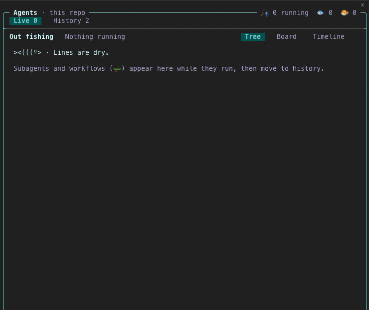
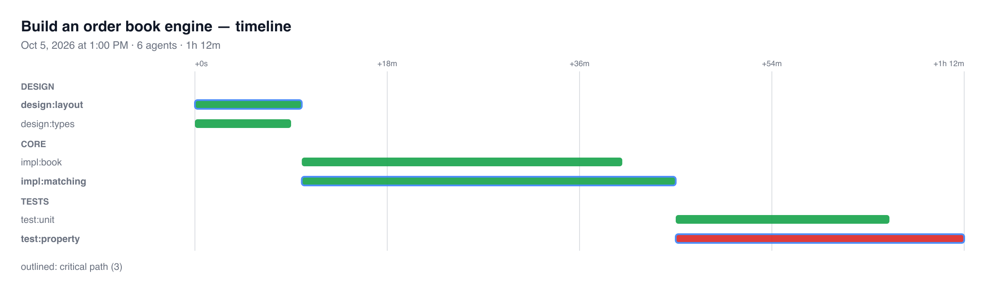

# agent-tree

A side pane for Claude Code that shows your subagents and workflows as a live tree. You see who is running, what each agent is doing now, how long it took and how many tokens it used. When a run ends, it moves to History, where you can replay it as a timeline or a trace.



## Install

Type this at the Claude Code prompt:

```
/plugin install agent-tree --marketplace SeanoChang/agent-tree
```

Answer `y` to add the marketplace, then pick a scope (user scope loads it in every session). The pane is active at once; no restart is needed.

Open the pane with `/agent-tree`. It also opens by itself when a subagent starts and the terminal is at least 144 columns wide.

**Needs:** a Claude Code build that runs function-hook mods (tested on 2.1.292). Optional: `rsvg-convert` (`brew install librsvg`) to save PNG pictures.

## What it shows

| View | What you get |
|---|---|
| **Tree** | Each run with its agents nested under it: status, the current step, model, tokens and time |
| **Timeline** | One bar per agent. The **critical path** (the chain of agents that set the end time) is heavy, and dots mark idle time |
| **Trace** | One lane per agent, with every tool call, edit and hand-back in order. Search it with `/`, jump between problems with `n` `p` |
| **Board** | Agents grouped by status |
| **History** | The last 150 runs across sessions, per repo, with a short report for each |

More:

- **Compare runs.** Press `m` on two runs, or `=` to compare a run with its last run of the same work. You see time, idle time, tokens by model, failures, tool calls and the files each run changed.
- **Insights.** One-line notes flag what needs a look: failed agents, an agent that made no tool call for a while, two agents that edited the same file, a workflow phase that took most of the time, and the agent that used the most tokens.
- **Export.** `x` saves the open Timeline or Trace as SVG (and PNG) in `~/Downloads/agent-tree/`.
- **Desktop app.** The pane has a native view for the Code tab in the Claude desktop app.



## Keys

Click the pane (or press `ctrl+x tab`) to give it the keyboard. `?` lists every key.

Arrows move inside one zone at a time, like a TV remote. In the content, `↑` `↓` move and `←` `→` fold. To switch a tab or a view, press `↑` on the top row to reach the bar, then `←` `→`. Direct keys work from anywhere: `1` `2` for Live and History, `v` for the next view, `?` for help.

## Settings

Run `/plugin`, pick agent-tree, and set:

| Option | Values | Default |
|---|---|---|
| `theme` | `minimal` (plain glyphs, any terminal), `kitty`, `fish`, `dog` (colours and emoji) | `minimal` |
| `ai` | `off` (no model calls), `cheap` (Haiku writes run reports and titles), `full` (also Sonnet on demand: `e` explains a run, `g` finds patterns in History) | `cheap` |

The `cheap` and `full` modes make model calls on your account. Set `ai` to `off` if you do not want that.

## How it works

The mod listens to Claude Code's hook events (agent spawn, tool calls, turn end) and keeps live runs in session state and History in the plugin store. It reads subagent transcripts only when you open a trace. See [docs/ARCHITECTURE.md](docs/ARCHITECTURE.md) for the data flow and the key map.

## Develop

```sh
git clone https://github.com/SeanoChang/agent-tree && cd agent-tree
claude --plugin-dir .          # run it from the folder
claude plugin validate .
claude plugin test .
```

## Feedback

Issues and ideas are welcome: open an issue or a discussion. A screenshot of the pane helps most.

## License

MIT. See [LICENSE](LICENSE).
