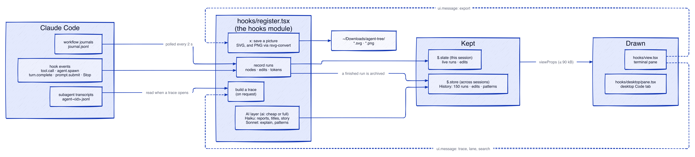
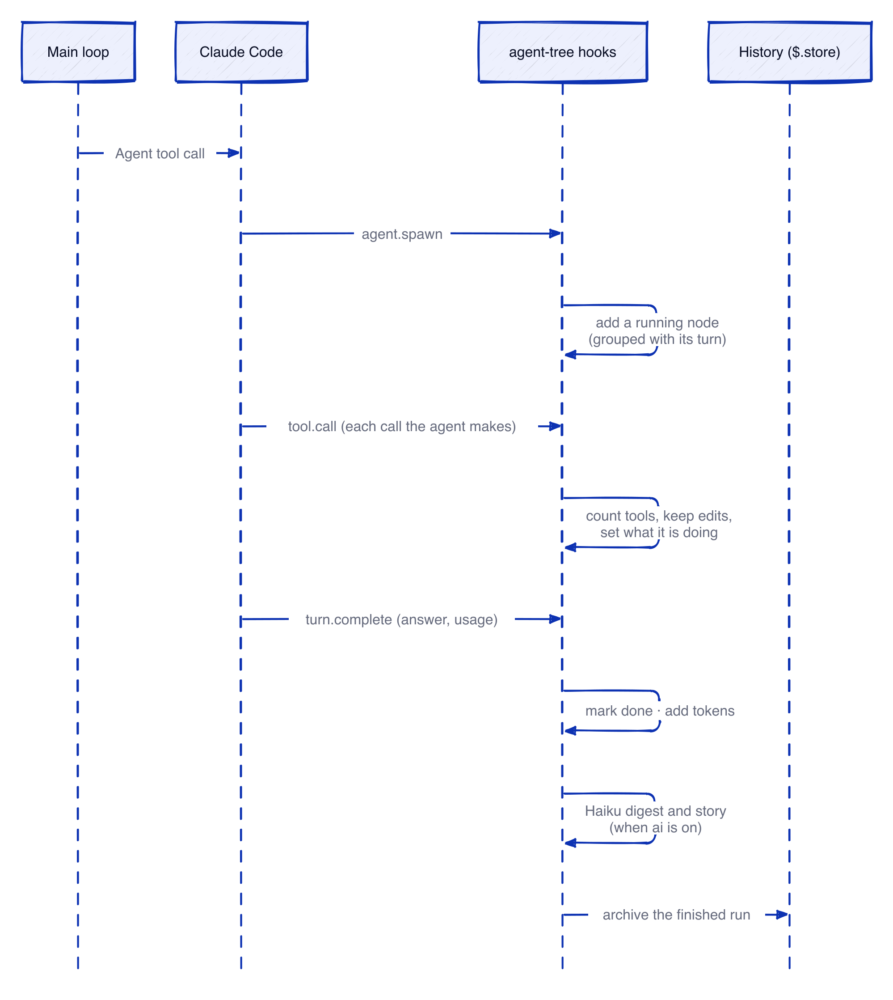
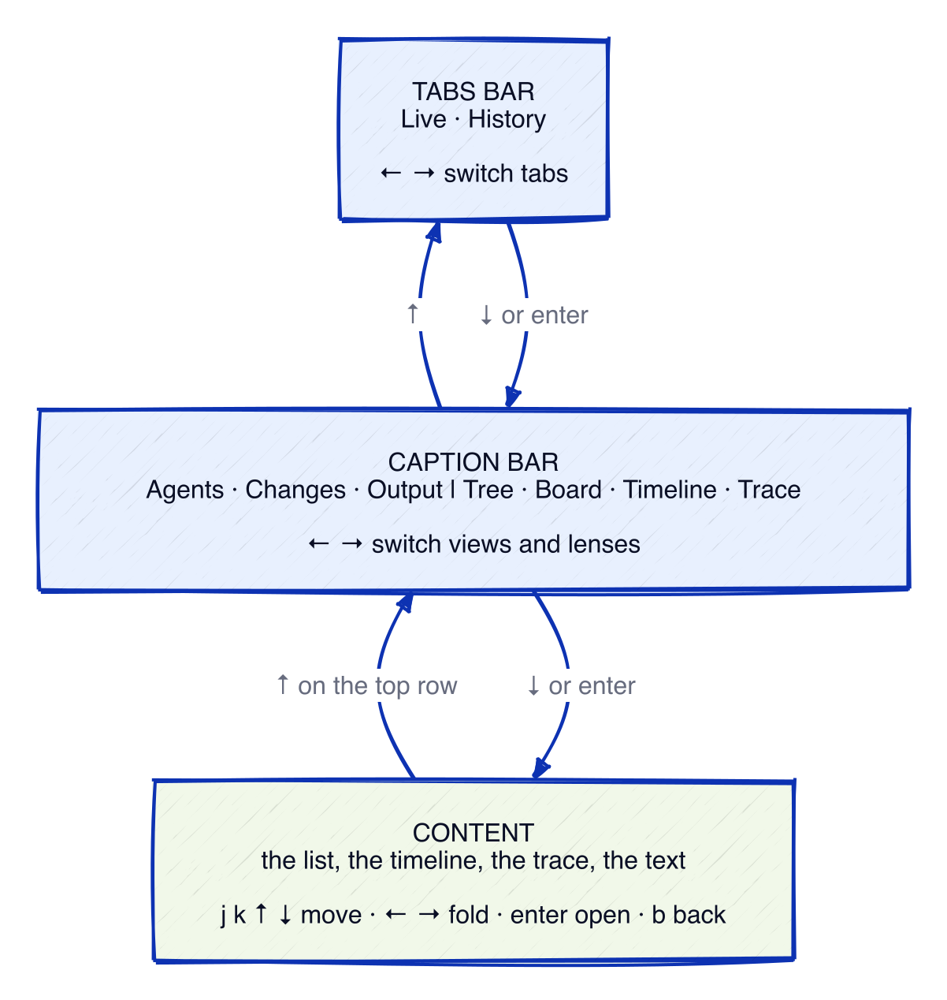
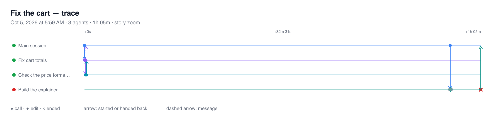

# How agent-tree works

agent-tree is a Claude Code mod. It draws a pane of the subagents and workflows that a session runs. This page shows where its data comes from, how a run moves through it, and how its keys work.

The diagrams are D2 sources in `docs/diagrams/`. After you edit a `.d2` file, run `docs/diagrams/render.sh` to draw its PNG again. The script needs `d2` and `rsvg-convert`.

## Where the data comes from

- **Hook events** record each run as it happens: its agents, their tool calls, their edits and their tokens.
- **Workflow journals** give each workflow agent its label and phase. The mod polls them every 2 seconds.
- **Subagent transcripts** are read only when a trace opens. They are never read on a redraw.
- `$.state` holds this session's live runs. `$.store` holds History across sessions: the last 150 runs, their edits and their patterns.
- The views get one bounded set of props (90 kB at most). They ask the hooks for more through `ui.message`: a diff, a trace window (cut to one lane or searched), or a picture to save.

## One run, from start to History

When every agent under a top-level run has ended, the run moves from Live to History.

## Keys: a remote control

Arrows move inside one zone at a time. In the content, ← and → only fold the tree. To switch a tab, a view or a lens, press ↑ on the top row to reach the bar, then press ← or →. Press ↓ or enter to go back down. The direct keys still work from anywhere: `1` `2` for Live and History, `a` `c` `o` for the views, `v` for the next lens.

## Where the time went

The Timeline marks the **critical path**. This is the chain of agents that set the run's end time. The chain starts at the agent that ended last. Then it goes back to the agent that ended last before that one started, and so on. Its bars are heavy; the other bars are light. Dots mark idle time, when no agent ran.

`x` saves the open Timeline or Trace as a picture in `~/Downloads/agent-tree/`. It always saves an SVG, and it also saves a PNG when `rsvg-convert` is installed.

## Compare two runs

Press `m` on a run to mark it. Then press `m` on a second run to see the two side by side. Or press `=` to compare a run with its last run of the same work (same workflow name, else same label). The page shows time, idle time, agents, failures, tokens, tool calls, files and lines. It also shows each phase's time, tokens by model, and which files each run changed. A change is green where run B did better than run A. With `=`, B is the run you are on and A is the earlier one.
