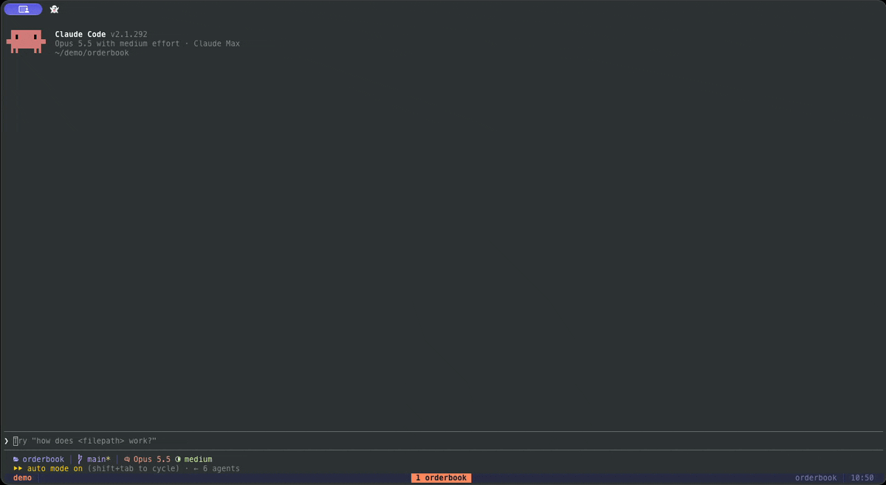

# brief

Plans, designs and walkthroughs in a live pane beside the chat. When you ask Claude Code for a plan, a design choice or "how does this work", it writes a **brief**: a scrollable document of sections, with diagrams, code, tables and option cards. You read it in parts, answer the open decisions in place, and watch each step get done with evidence attached. No browser and no copy-paste.



## Install

Type this at the Claude Code prompt:

```
/plugin install brief --marketplace SeanoChang/brief
```

Answer `y` to add the marketplace, then pick a scope (user scope loads it in every session). It is active at once; no restart is needed.

**Needs:** a Claude Code build that runs function-hook mods (tested on 2.1.292). Optional, for figures Claude draws as pictures: `d2` and `rsvg-convert` (`brew install d2 librsvg`), `mmdc` (Mermaid CLI) or Python with matplotlib.

## Use it

Ask the way you normally would. For example:

- "Plan adding stop-loss orders. What are the options?"
- "Walk me through how the matching engine works."
- "Why does this test fail?"

With auto mode on (the default), Claude opens the pane by itself for answers you will read in parts or decide on. Quick facts and short answers stay in the chat.

| Command | What it does |
|---|---|
| `/brief` | Open the pane |
| `/brief auto on` | Claude uses the pane on its own for plans, designs and walkthroughs |
| `/brief auto suggest` | Claude uses the pane when you ask; long answers offer "open as brief" |
| `/brief auto off` | The pane is used only when you ask |
| `/brief list` | List saved briefs |
| `/brief open <n or title>` | Reopen a saved brief |
| `/brief save` | Save the brief that is open |

The last brief for a folder comes back when a new session starts there.

## What a brief holds

- **Sections and points.** Each point is one claim, backed by one exhibit.
- **Exhibits.** Call stacks, flows, sequence diagrams, state machines, schemas, code with pinned notes, file trees, UI mockups, tables, and PNG figures (D2, Mermaid or matplotlib).
- **Decisions.** Option cards with pros, cons and an exhibit each, plus a compare view. Your choice goes back to Claude, and a decision log keeps what you chose.
- **Questions on a point.** Ask about one point from the pane. Claude answers under that point, even while it is busy with a turn.
- **Build status.** While Claude builds, each point moves through running, review and done or failed, with evidence (test output, a diff, a figure) attached to the point it proves. Subagents tagged `[brief <id>]` link to their point.

## Skills it ships

Four short skills that use the pane: `brief:test-first`, `brief:debugging`, `brief:verification` and `brief:review`. They load like any other skill.

## Status

Tested in the terminal (Ghostty with tmux). The Claude desktop app view is built but not yet tested there. `docs/TRIAL.md` is a test plan for comparing brief with the Superpowers plugin on real tasks.

## Develop

```sh
git clone https://github.com/SeanoChang/brief && cd brief
claude --plugin-dir .          # run it from the folder
claude plugin validate .
claude plugin test .
```

## Feedback

Issues and ideas are welcome: open an issue or a discussion. A screenshot of the pane and the prompt you used help most.

## Credits and license

brief draws its blocks with the parsers and layouts of [html-plan](https://github.com/anthropics/claude-plugins-community/tree/main/html-plan) by Thariq Shihipar, copied unchanged into `hooks/core.js`. See [NOTICE](NOTICE).

MIT. See [LICENSE](LICENSE).
