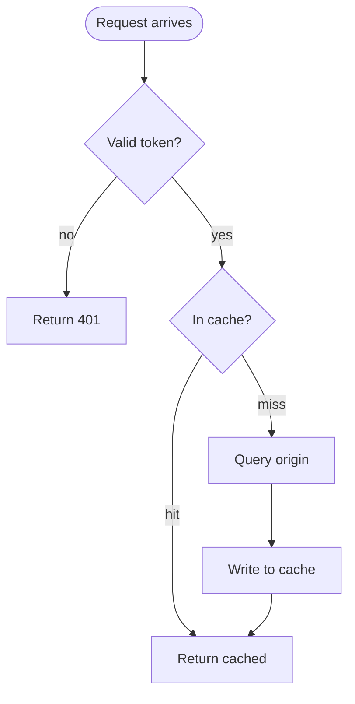
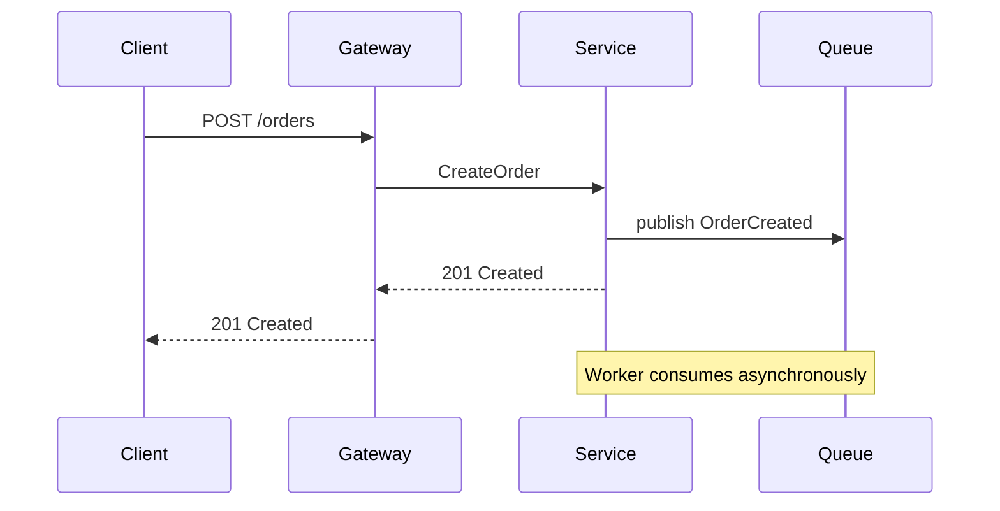
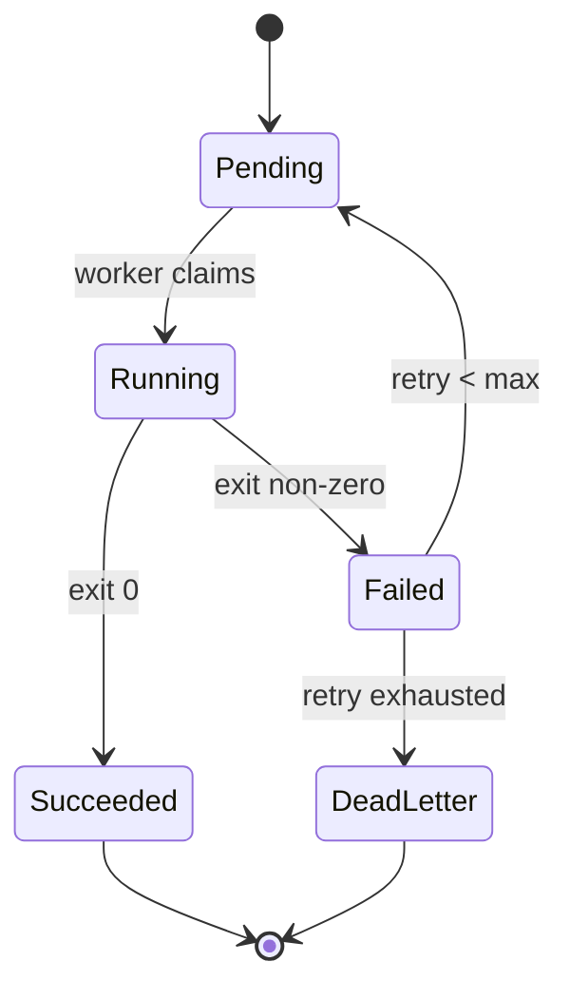
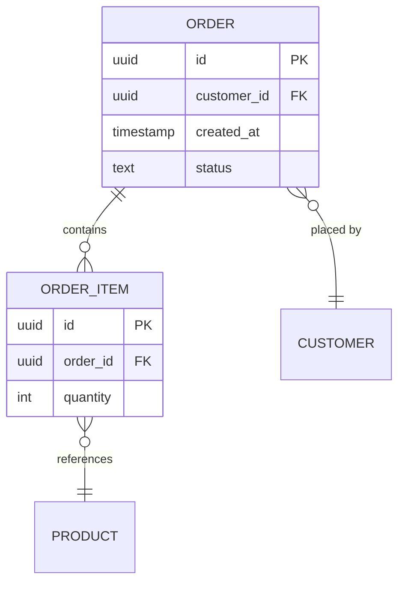
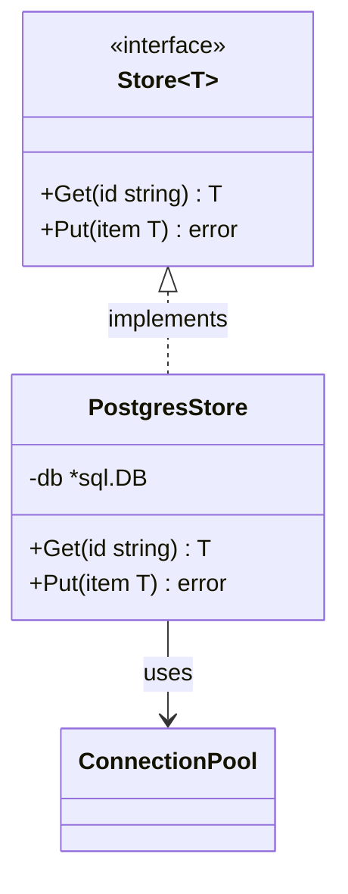
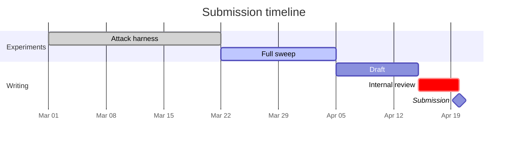
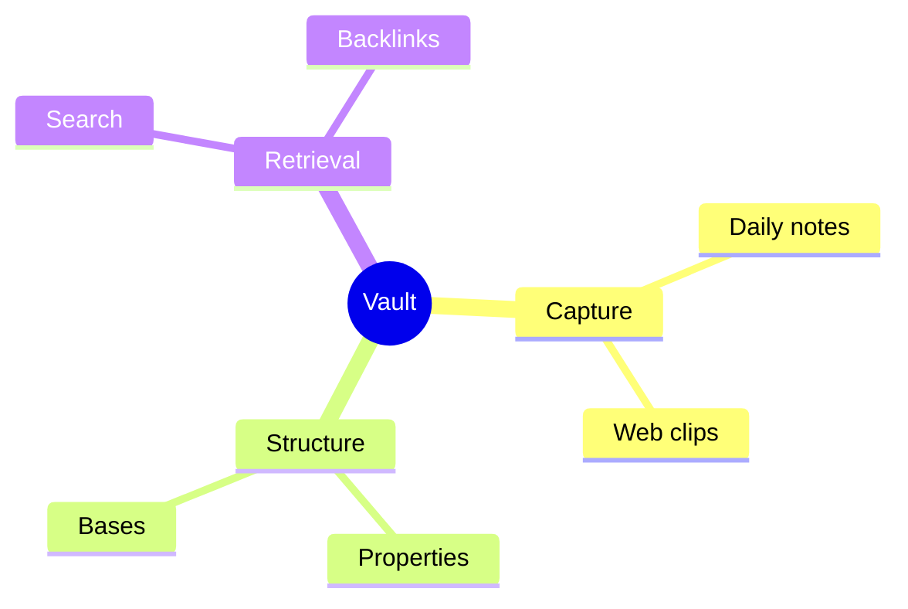
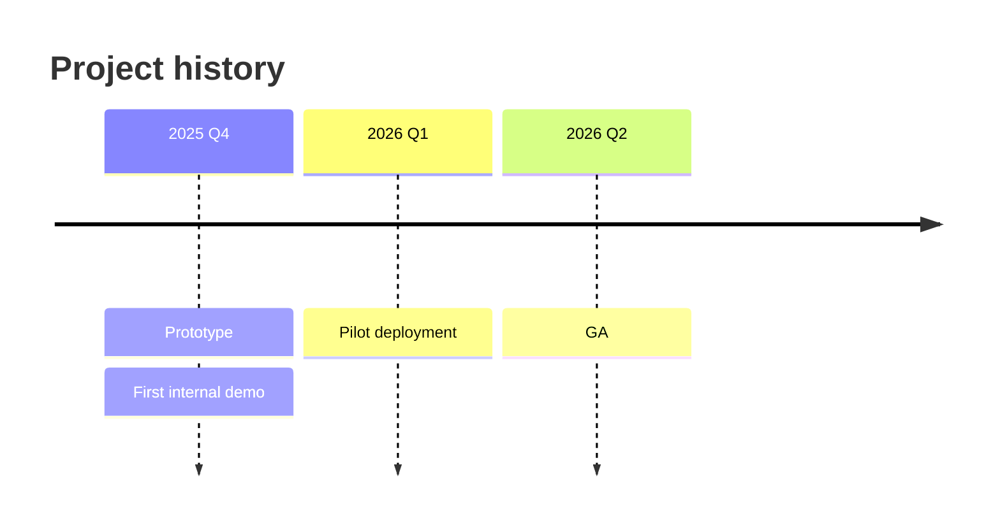
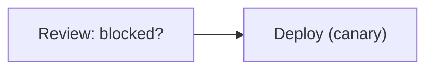
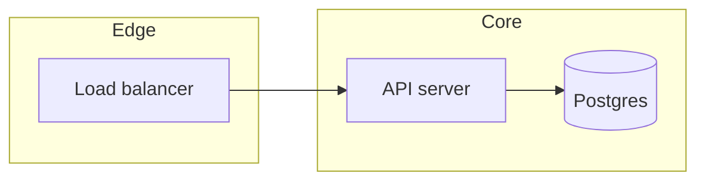

# Mermaid in Obsidian

Mermaid is the default answer for anything with the shape of a graph, because the source is plain text: greppable, diffable, and readable even where it doesn't render.

> [!warning] Greenfield in this vault
> Three notes use Mermaid — one `gantt`, one `graph`, one `pie`. No `flowchart`, `sequenceDiagram`, `erDiagram`, `stateDiagram`, or `classDiagram` exists anywhere. Meanwhile 806 notes use tables.
>
> That asymmetry is mostly correct: a table beats a diagram for comparison across dimensions, which is most of what this vault does. **Do not replace a working table with a diagram.** The established habit is an ASCII pipeline with `->` arrows placed *before* a table — keep that placement, and upgrade the ASCII to Mermaid only when the shape has branching, cycles, actors, or state. A linear pipeline stays ASCII.

## Contents

- [The version problem](#the-version-problem)
- [Which diagram type](#which-diagram-type)
- [Patterns](#patterns)
- [Failure modes](#failure-modes)
- [Style and readability](#style-and-readability)

---

## The version problem

**Obsidian ships a bundled copy of Mermaid that lags upstream by months.** New diagram types and syntax are usable on mermaid.live, in GitHub, and in the docs long before they render in Obsidian. A diagram using a too-new feature produces an error box in the user's vault, and there is no way to tell from the source that this will happen.

Treat diagram types in three groups:

**Safe — long-established, assume available**

`flowchart` / `graph` · `sequenceDiagram` · `classDiagram` · `stateDiagram-v2` · `erDiagram` · `gantt` · `pie` · `journey` · `gitGraph` · `mindmap` · `timeline` · `requirementDiagram`

**Verify before using — newer, may or may not be in the user's build**

`quadrantChart` · `sankey-beta` · `xychart-beta` · `C4Context` and friends

**Assume unavailable unless the user says otherwise — recent additions**

`block-beta` · `packet-beta` · `architecture-beta` · `kanban` · `treemap-beta` · `radar` · `zenuml`

Anything with a `-beta` suffix is a signal, not a guarantee — some beta types have been available for years and some stable types are recent. When in doubt: use a Safe type that expresses the same shape, or tell the user the diagram needs a current Mermaid and let them decide.

If a user needs current Mermaid, the **Mermaid Next** community plugin registers a `mermaid-next` block rendered against an up-to-date build. Worth mentioning once; not worth assuming.

---

## Which diagram type

| The information is… | Type |
|---|---|
| Steps with branches and merges | `flowchart` |
| Messages exchanged between actors over time | `sequenceDiagram` |
| A thing that is in exactly one of several states | `stateDiagram-v2` |
| Entities, their fields, and cardinality between them | `erDiagram` |
| Types, their members, and inheritance | `classDiagram` |
| Work items with durations and dependencies | `gantt` |
| A branching hierarchy radiating from one root | `mindmap` |
| Events in chronological order | `timeline` |
| Branch and merge history | `gitGraph` |

If none of these fits, the shape probably isn't a graph — reconsider a table, a nested list, or prose.

Two negative rules worth stating plainly:

**A linear sequence of steps is not a flowchart.** If there are no branches, a numbered list is clearer, editable, and searchable. Reach for `flowchart` when there is a decision, a loop, or a fan-out.

**A hierarchy is not a mindmap.** Nested bullets already express hierarchy, in Tier 1, with no rendering dependency. Use `mindmap` when the visual radial layout is itself the point — brainstorming output, a topic map someone will scan rather than read.

---

## Patterns

One worked example per type. These use the conservative syntax that has been stable for years.

### Flowchart — branching process

Directions: `TD`/`TB` top-down, `LR` left-right, `BT`, `RL`. Prefer `TD` for decision logic and `LR` for pipelines.

Node shapes carry meaning — use them consistently: `([rounded])` for start/end, `[rectangle]` for a step, `{diamond}` for a decision, `[(cylinder)]` for a datastore, `[[subroutine]]` for a call out to another process.

### Sequence — interaction over time

`->>` solid arrow, `-->>` dashed (use for responses), `-x` for a failed or dropped message. `activate`/`deactivate` or `S->>+S:` shows lifelines when the point is *how long* something holds a resource.

This is the right type whenever the answer to "who is talking to whom, in what order" is the thing being explained. A flowchart loses the actors.

### State — lifecycle

Use `stateDiagram-v2`, not `stateDiagram` — the v2 renderer is the maintained one. `[*]` is the start/end pseudo-state. Composite states via `state Name { ... }` when substates matter.

The value of a state diagram over a flowchart is that it makes *invalid* transitions visible by their absence.

### ER — data model

Cardinality reads left-entity-first: `||` exactly one, `o|` zero or one, `}o` zero or more, `}|` one or more. So `ORDER ||--o{ ORDER_ITEM` is "one order has zero or more items".

Relationship labels containing spaces must be quoted.

For a large schema, don't draw all of it. Draw the cluster under discussion and link to notes for the rest — a 30-table ERD is unreadable at any width.

### Class — type relationships

`<|--` inheritance, `<|..` interface implementation, `-->` association, `*--` composition, `o--` aggregation. Generics use `~T~` because angle brackets are HTML.

### Gantt — schedule

Tags: `done`, `active`, `crit`, `milestone`. `after <id>` expresses dependency without hardcoding dates — which is what makes a Gantt worth keeping in a note rather than a screenshot from a project tool.

### Mindmap and timeline

Mindmap indentation defines hierarchy — it is whitespace-sensitive and unforgiving. Root shape via `((circle))`, `[square]`, or `)cloud(`.

---

## Failure modes

**Special characters in labels.** Anything with `:`, `(`, `)`, `,`, `#`, `-`, or `>` inside a node label must be quoted:

Unquoted, these produce a parse error or silently mangle the shape.

**`end` is a reserved word.** A lowercase `end` as a node id or label breaks flowcharts. Use `End`, `END`, or `["end"]`.

**Config directives are unreliable.** `%%{init: {...}}%%` blocks are honored inconsistently in Obsidian — the renderer choice in particular is often ignored. Don't build a diagram that only reads correctly with a custom config.

**Hardcoded colors break dark mode.** `classDef` with explicit hex fills will be unreadable in whichever theme wasn't tested. Let Mermaid inherit Obsidian's theme; if a node genuinely must be highlighted, use shape or a `:::className` on a single node and accept the default palette.

**Wikilinks don't work inside Mermaid blocks.** `[[Note]]` is literal text there. To make a node open a note, use a `click` directive with an `obsidian://` URI — but this is brittle across vault renames, so prefer putting the link in the prose next to the diagram.

**Wide diagrams overflow.** A flowchart with more than about six nodes on one row will run past the note width. Restructure with `TD` instead of `LR`, split into two diagrams, or use subgraphs. A CSS snippet (`.markdown-preview-view .mermaid svg { max-width: 100%; }`) scales them to fit and is worth suggesting once to users who hit this.

**Line breaks inside labels** use ` `, not `\n`.

---

## Style and readability

**Cap it at roughly seven nodes.** Beyond that, comprehension drops faster than information rises. Two diagrams with prose between them beat one dense diagram, every time.

**Name nodes for what they are, not `A`, `B`, `C`.** The source is read by humans — `Auth{Valid token?}` is self-documenting where `B{Valid?}` is not. Short ids are fine when they're mnemonic (`db`, `lb`, `q`).

**Label every edge that isn't obvious.** If the reader has to guess why A points to B, the edge needs `-->|reason|`.

**Use `subgraph` for grouping, sparingly.** Two or three subgraphs clarify; five nested ones obscure.

**Always surround a diagram with prose.** One sentence before it saying what to look for, one after saying what it implies. A diagram dropped into a note without framing is decoration, and decoration is what a future reader skips.
